# Lab 1 : Identity and Access Management (IAM)

## 1. Aim / Objective

The objective of this practical is to set up a local AWS development environment using the Floci emulator and Docker Compose, and to use the AWS CLI to build an IAM foundation for a University Student Management System (USMS); including groups, users, policies, roles, and temporary credentials.

## 2. Introduction

AWS Identity and Access Management (IAM) is a global AWS service that enables administrators to securely manage authentication and authorization for AWS resources. IAM allows organizations to create users, organize them into groups, assign permissions through policies, and grant temporary access using roles.

This lab was completed entirely through the AWS CLI against **Floci**, a local, open-source AWS emulator run via Docker Compose. Floci exposes the same API as real AWS on `http://localhost:4566`, allowing IAM to be practiced safely and offline. No AWS Management Console was used; all evidence in this report is CLI-based.

### Key Features

- User Management
- User Groups
- IAM Roles and Trust Policies
- AWS Managed, Customer Managed, and Inline Policies
- Temporary Security Credentials (STS `AssumeRole`)
- Policy Simulator

## 3. Use Case

The USMS team employs cloud administrators, developers, and auditors. Instead of giving every employee full access, the administrator creates IAM groups and roles so permissions scale safely as the team grows.

| Identity | Type | Used By | Permissions |
|---|---|---|---|
| `usms-admin-01` | User → `usms-admins` | Lead cloud engineer | Broad (course-scoped) |
| `usms-dev-01` | User → `usms-developers` | Developer | Build + inspect USMS resources |
| `usms-audit-01` | User → `usms-auditors` | Auditor | Read-only |
| `usms-ec2-app-role` | Role | Application server | Read/write student data (S3) |
| `usms-lambda-exec-role` | Role | Notification functions | Logs + messaging |
| `usms-developer-role` | Role | Assumed temporarily by developers | Elevated build permissions |

Each user is placed in a group rather than having policies attached individually, enforcing the **Principle of Least Privilege**.

## 4. System Architecture / Design

For this lab which is just to create user roles, groups and policies i have no proper architecture to include so i am leaving as it is.

## 5. Implementation Procedure

The practical began by setting up the local environment: Docker and the AWS CLI were verified, a project directory was structured to separate policies, config, scripts, and secrets, and a `.gitignore` was created and tested before Git was initialized. Floci was launched via Docker Compose with persistent (`hybrid`) storage on a host bind mount, and the AWS CLI was pointed at it through a dedicated `floci` profile. Isolation from real AWS and persistence of data across restarts were both explicitly verified.

With the environment ready, the IAM foundation was built: three groups (`usms-admins`, `usms-developers`, `usms-auditors`) and three users were created and linked together. An AWS managed policy, two customer managed policies, and one inline policy were written and attached, following the rule that permissions belong on groups, not individual users. Two service roles (EC2, Lambda) and one human-assumable role were created, each with a separate trust policy defining who can assume it. Temporary credentials were then obtained via `sts assume-role`, long-lived access keys were generated and stored safely outside Git, and the IAM Policy Simulator was used to validate permissions, since Floci does not enforce IAM policy evaluation the way real AWS does.

## 6. Results and Evidence

### 6.1 Part A : Environment Setup

- **Step 1–2 (Docker check):** Confirmed Docker, the Docker daemon, and Docker Compose v2 were installed and running. 
- **Step 3–4 (Floci install):** Installed the Floci CLI and ran `floci doctor` to confirm Docker, port 4566, and the Floci image were all ready. 
- **Step 5 (Project structure):** Created the `aws-floci-course` directory tree (`policies/`, `configs/`, `scripts/`, `outputs/`, etc.). 
- **Step 6 (.gitignore before Git):** Wrote `.gitignore` and initialised Git before any secret existed, then proved a test secret was correctly blocked by `git check-ignore`. 
- **Step 8 (docker-compose.yml):** Wrote `docker-compose.yml` and `configs/course.env` to pin Floci to durable `hybrid` storage; `docker compose config` failed as expected since `.env` didn't exist yet, confirming the safety guard works. 
- **Step 9.3 (Start Floci):** Ran `./scripts/setup/floci-up.sh` to bring the environment up with a verified host bind mount.

    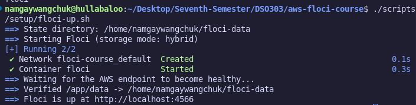
    
  **Provided screenshot**: shows the container starting and `/app/data` confirmed as a real bind mount, not a disposable volume.

- **Step 9.3 (Health check):** Verified Floci was reachable via `docker compose ps`, `floci status`, and `curl http://localhost:4566/_floci/health`.

    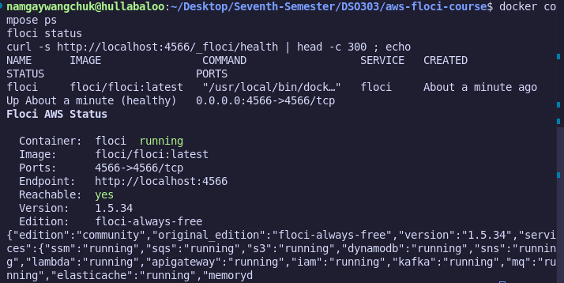

- **Step 10 (AWS CLI):** Confirmed AWS CLI v2 was installed with `aws --version`. 
- **Step 12 (CLI profile):** Configured a `floci` AWS CLI profile pointing at `http://localhost:4566`.

    ***Individual Activity :***
    Run aws configure `list --profile floci`. Identify which column tells you where each value came from, and explain why the Type for the access key says shared-credentials-file.
    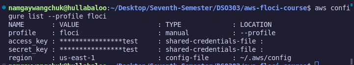

    The output has four columns; `Name, Value, Type, Location`. The Location column is the one that answers "where did this come from"; for the access key and secret it will say something like `~/.aws/credentials`, and for region/ output/endpoint_url it will point at `~/.aws/config`.

- **Step 13 (First CLI call):** Ran `aws sts get-caller-identity` and the `whoami.sh` helper script to confirm the CLI was talking to Floci (Account `000000000000`).

    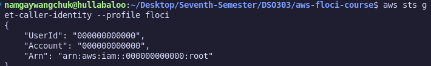
  **Provided Screenshot** : shows the identity check succeeding.
- **Step 14 (Isolation proof):** Used `--debug` to confirm requests were going to `http://localhost:4566`, then stopped Floci and confirmed the CLI failed — proving commands never reach real AWS.

    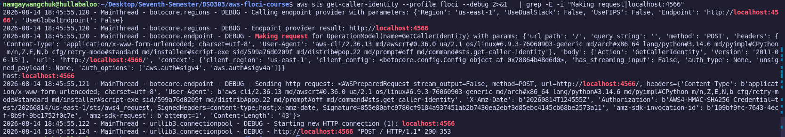
  **Provided Screenshot**: shows the debug output and/or the connection failure.
- **Step 14 (Persistence proof):** Created a test IAM user, restarted the Floci container, and confirmed the user still existed afterward; proving data survives a restart.

    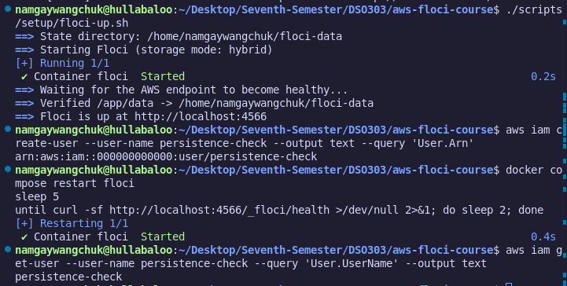

    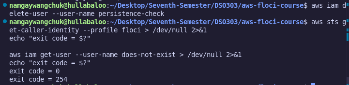
  **Provided Screenshot** : shows the user present after restart.
- **Step 15 (Storage diagnostics):** Ran `floci-storage-check.sh`, which reported all checks `[ok]`, confirming storage mode, bind mount, and host directory were all correctly configured. 

    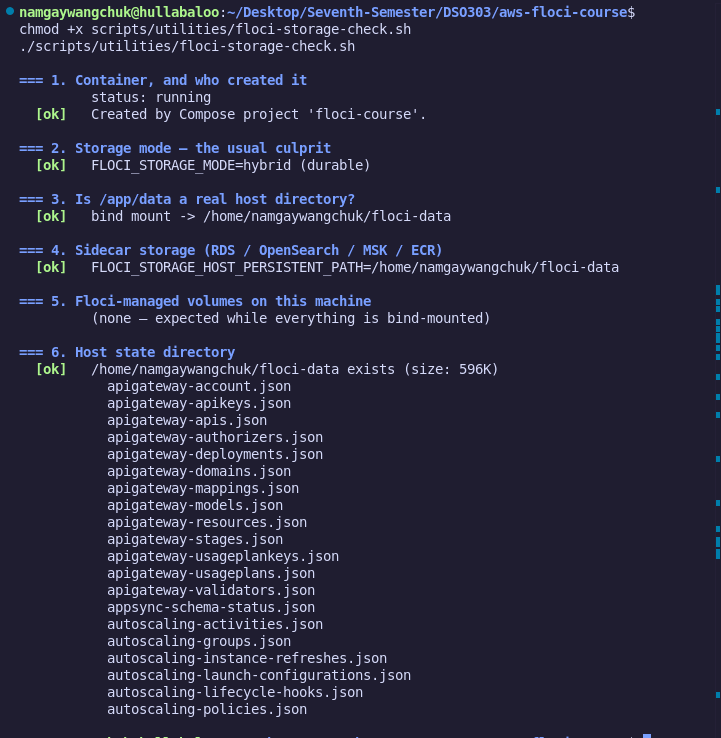

### 6.2 Part B : Building the IAM Foundation

- **Step 16 (IAM concepts):** Reviewed IAM building blocks (users, groups, roles, policies), the difference between a permissions policy and a trust policy, and the anatomy of an ARN; no commands run. 
- **Step 17 (Inspect empty account):** Ran `aws iam list-users` in JSON, table, and text formats to confirm the account started with zero users.

    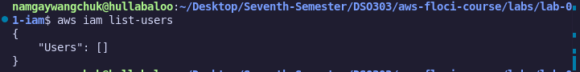

    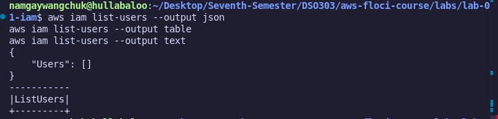

    ***Individual Activity :***
    Run aws iam `list-roles --output table`. Floci may pre-create some service-linked roles. Are the results the same in text format? Which one would you use inside a script, and why?

    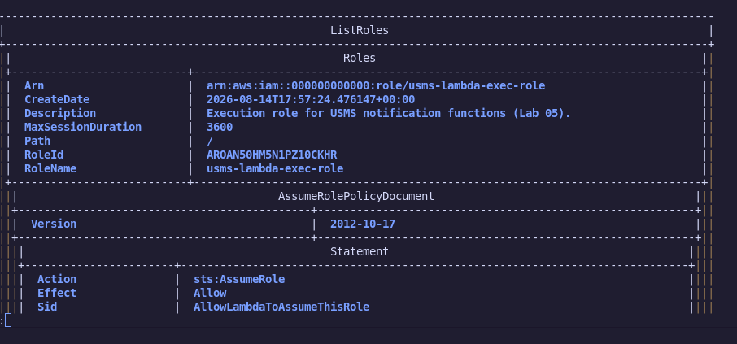
    *The table output is the same data formatted with borders and headers easier to read.*

- **Step 18 (Create groups):** Created `usms-admins`, `usms-developers`, and `usms-auditors` with `aws iam create-group`, verified via `aws iam list-groups`.

    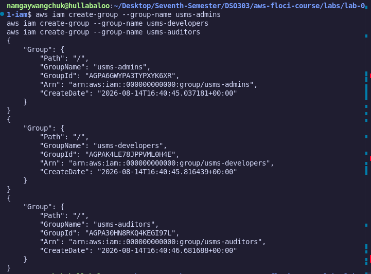

    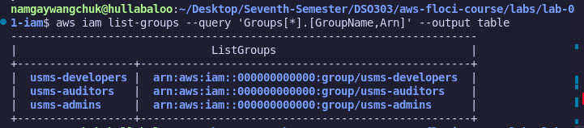

- **Step 19 (Create users):** Created `usms-admin-01`, `usms-dev-01`, and `usms-audit-01` with `aws iam create-user`, and captured each user's ARN.

    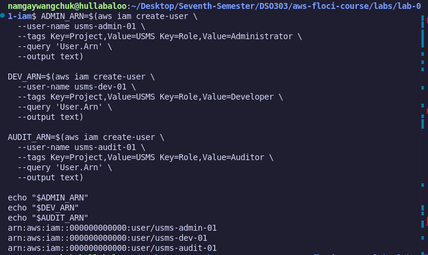

    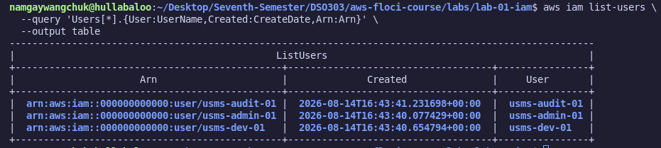

    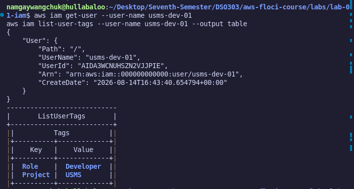

    ***Individual Activity :***
    Create a fourth user `usms-intern-01`, tagged `Key=Role,Value=Intern`, capturing its ARN into a variable named `INTERN_ARN`. Then display only the `UserId` of that user using `get-user` and `--query`.

    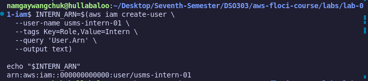

    *Verification that usms-intern-01 created*
    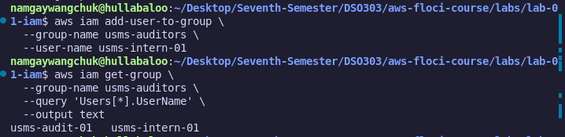

- **Step 20 (Add users to groups):** Added each user to its matching group with `aws iam add-user-to-group`, verified with `aws iam get-group`.
    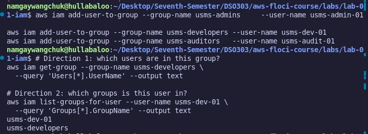

    ***Individual Activity :***
    Put `usms-intern-01` (from Step 19) into `usms-auditors`, then verify with a single command that the auditors group now has two members.
    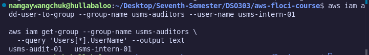

- **Step 21 (AWS managed policy):** Attached the AWS managed `ReadOnlyAccess` policy to `usms-auditors` with `aws iam attach-group-policy`.

    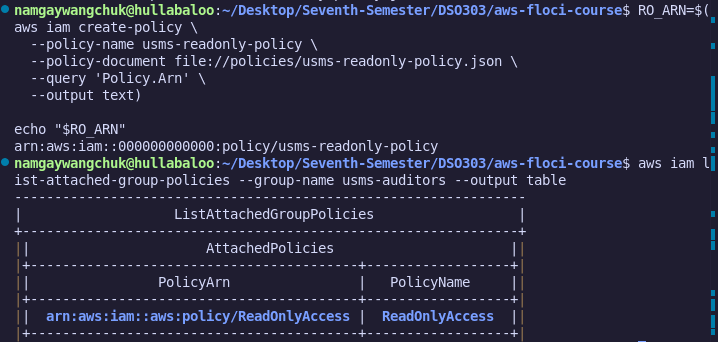

- **Step 22 (Customer managed policy):** Wrote and created `USMSDeveloperBase` with `aws iam create-policy`, then attached it to `usms-developers`.

    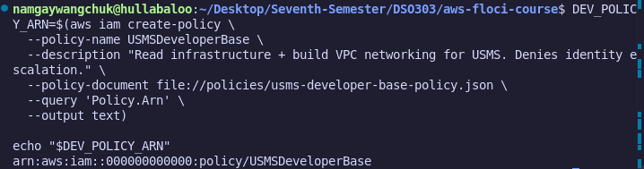

    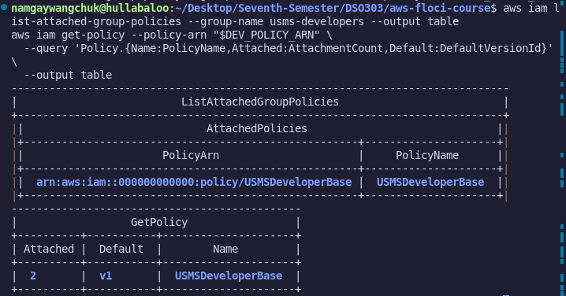

- **Step 23 (S3 data policy):** Wrote `USMSStudentDataReadWrite`, carefully distinguishing the bucket ARN from the object ARN (`/*`), for later reuse in Lab 4. 

    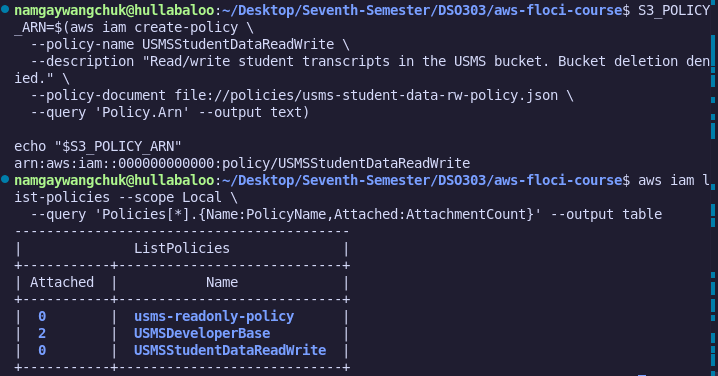

    ***Individual Activity :***
    Generate a skeleton for `aws iam create-policy` and for `aws ec2 create-vpc` (you'll need the latter in Lab 2). Save both in templates/. Which parameter of create-vpc looks like the most important one?

    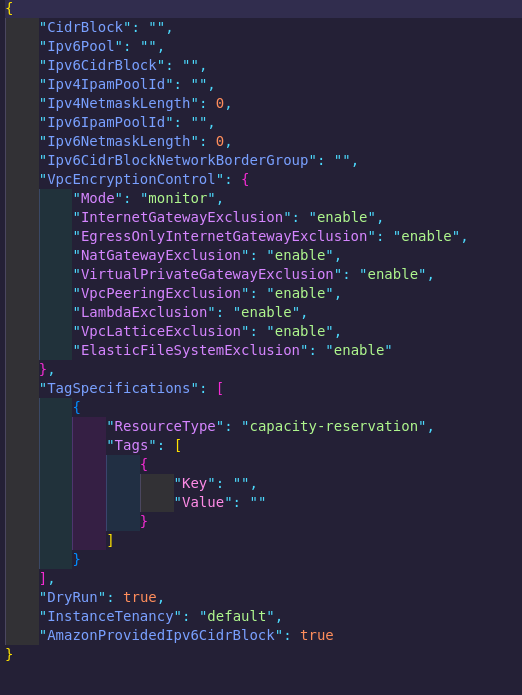
    *Ran the command and it created with fields like **CidrBlock, InstanceTenancy, TagSpecifications**, etc. The most important one is **CidrBlock** as it's the one field with no sensible default; it defines the entire IP address range of the VPC, and everything else (subnets, routing) is built on top of it*

- **Step 25 (Inline policy):** Added one inline policy, `USMSSelfManageCredentials`, directly to `usms-dev-01` with `aws iam put-user-policy`; the single deliberate exception to "permissions go on groups, not users."

- **Step 26 (Inspect what was built):** Ran `list-attached-user-policies`, `list-attached-group-policies`, and `list-user-policies` to review the full permission picture.

    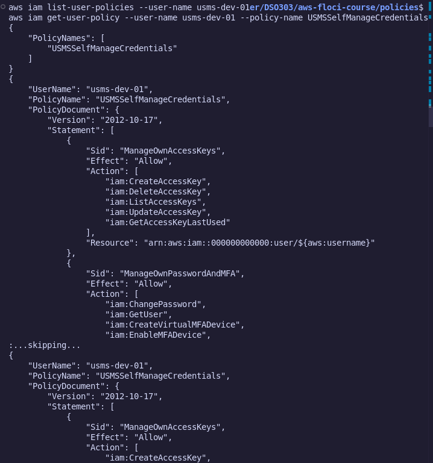

- **Step 27 (Policy versions):** Ran `aws iam list-policy-versions` on a customer managed policy to see how IAM versions policy documents. 

    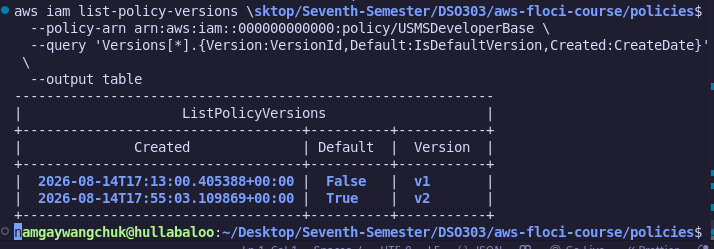

- **Step 28 (EC2 role):** Created `usms-ec2-app-role` with `aws iam create-role`, using a separate trust policy (`trust-ec2.json`) so only EC2 can assume it. Verified with `aws iam get-role`.

- **Step 29 (Lambda role):** Created `usms-lambda-exec-role` the same way, using `trust-lambda.json`.

- **Step 30 (Temporary credentials):** Created `usms-developer-role` for human elevation, then called `aws sts assume-role` to obtain short-lived temporary credentials.

    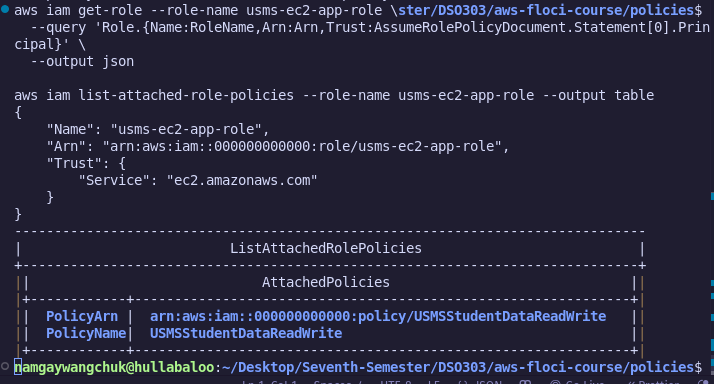

    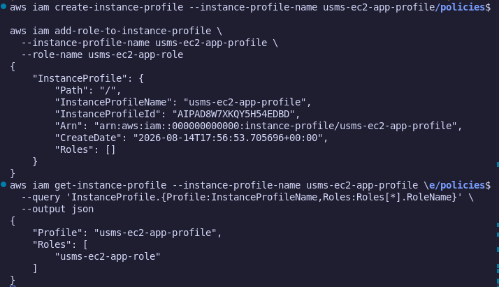

    **Provided screenshot**: shows the `AccessKeyId` / `SecretAccessKey` / `SessionToken` / `Expiration` returned.

  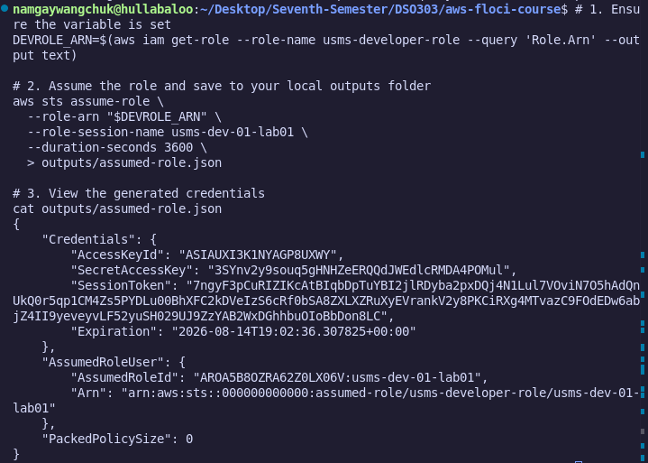

  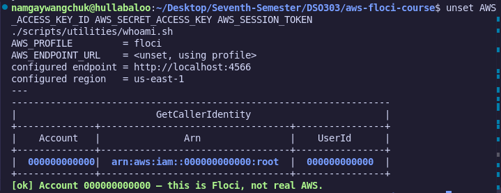

- **Step 31 (Access keys):** Generated a long-lived access key for `usms-dev-01` with `aws iam create-access-key`, and saved it to the git-ignored `outputs/` folder — never committed.

    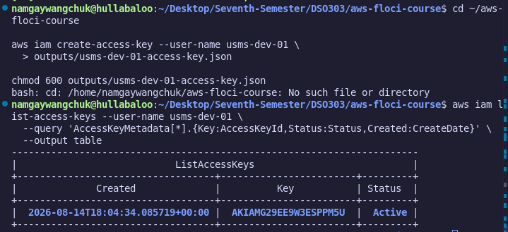

    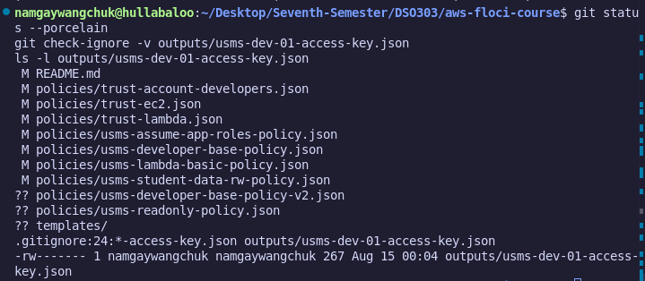

- **Step 32 (Policy Simulator):** Used the IAM Policy Simulator (`aws iam simulate-principal-policy`) to test whether specific actions would be allowed, since Floci doesn't enforce IAM policies by default.

    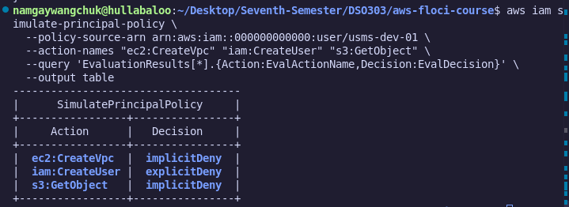

    ***Individual Activity :***
    Predict before running anything; the decision for `usms-audit-01` on `ec2:CreateVpc` and on `ec2:DescribeVpcs`. Write your prediction in `notes/lab-01-notes`.md, then check it. If Floci does not support the simulator, justify your prediction by quoting the relevant statement from the policy JSON.

    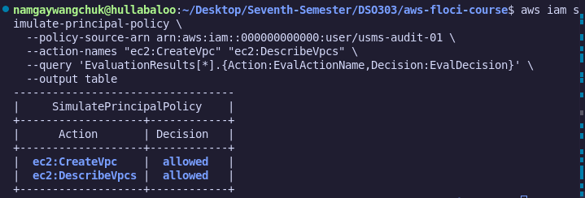
    *Predictions were all done and accessible to this path `notes/lab-01-notes`. The predictions were also correct as the table returend with `implicitDeny` for `CreateVpc` and `allowed` for `DescribeVpcs`*

### 6.3 Verification

## 7. Analysis and Discussion

The practical showed how IAM separates *who* (users/roles) from *what they can do* (policies), and how attaching permissions to groups instead of individuals keeps administration scalable. It also reinforced the difference between a role's permissions policy and its trust policy; a role needs both to be usable.

One limitation was that Floci does not enforce IAM policies by default, so `AccessDenied` errors could not be triggered directly; the Policy Simulator was used instead to validate intended permissions. All commands otherwise executed successfully, and every resource was verified using `list-*` / `get-*` CLI calls, including confirming that IAM state survived a container restart.

## 8. Reflection
 
This practical gave hands-on experience with IAM alongside a realistic local AWS development workflow using Docker and an emulator. The main takeaway was that permissions should live on groups and roles, not individual users, and that a role's trust policy and permissions policy are two distinct documents that are easy to conflate.

## 9. Conclusion

The objectives of this practical were successfully achieved. I gained practical experience creating IAM users, groups, policies (managed and inline), and roles with trust policies using the AWS CLI, and verified each step through further CLI commands.

This lab reinforced the importance of secure identity management and showed how IAM, built on least privilege and clear separation of permissions vs. trust, forms the foundation of AWS security.

## 10. Appendix

### Additional Files

- `docker-compose.yml`, `configs/course.env`
- `policies/usms-developer-base-policy.json`, `usms-student-data-rw-policy.json`, `usms-self-manage-credentials.json`
- `policies/trust-ec2.json`, `trust-lambda.json`, `trust-account-developers.json`
- `scripts/setup/floci-up.sh`, `floci-down.sh`
- `scripts/utilities/whoami.sh`, `floci-storage-check.sh`

