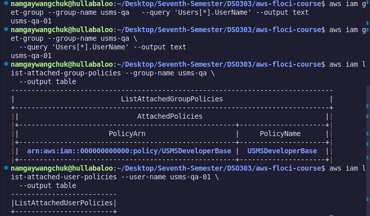
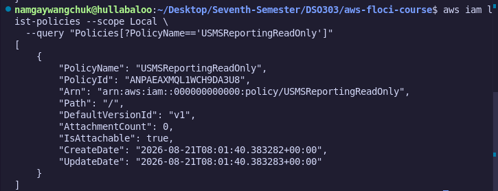
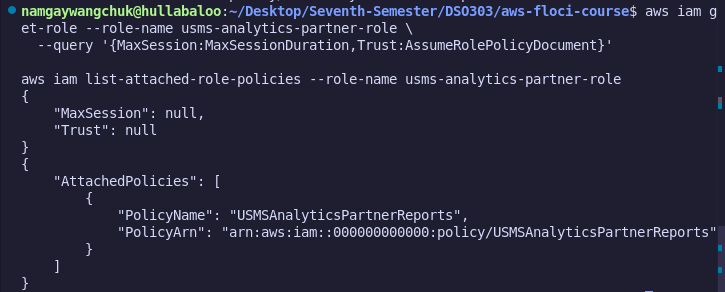
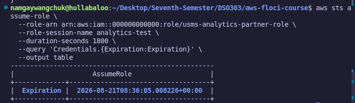
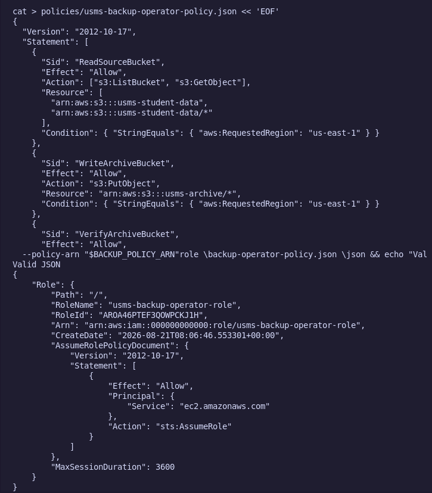

# Lab 1 :Independent Exercises Report

## Objective

To independently apply the IAM concepts practiced in Lab 1; groups, customer managed policies, roles with trust policies, temporary credentials, and least-privilege design; to five self-directed exercises.

## Exercise 1 : The QA Identity

Created group `usms-qa` and user `usms-qa-01`, tagged `Role=QA` / `Project=USMS`, and attached the existing `USMSDeveloperBase` policy to the group only (not the user), confirming least-privilege scoping at the group level.

## Exercise 2 : The Read-Only Reporting Policy

Wrote `USMSReportingReadOnly`, allowing `s3:ListBucket` scoped to the `transcripts/` prefix and `s3:GetObject` on transcript objects, with an explicit `Deny` on `s3:Put*` and `s3:Delete*` as a safety net against future over-broad policy attachments.

## Exercise 3 : The Third-Party Analytics Role

Built `usms-analytics-partner-role` with a trust policy scoped to `usms-audit-01` and a permissions policy limited to `s3:GetObject` on `reports/*`. `MaxSessionDuration` had to be set to AWS's real minimum of 3600 seconds (not 1800, as the brief implied); the 30-minute cap was instead enforced by passing `--duration-seconds 1800` at `sts assume-role` time.

## Exercise 4 : Least-Privilege Backup Operator

Chose a **role** over a user or group, since the backup job is unattended and automated; a role avoids any long-lived access key. Built a 4-statement policy: read the source bucket, write to the archive bucket, verify the archive contents, and write a completion log to CloudWatch Logs — each scoped to `us-east-1` via an `aws:RequestedRegion` condition, with no wildcard resources on any `Allow`.

**Abuse vectors identified (see `notes/lab-01-notes.md` for full detail):**
1. Compromised compute host inherits read/write access : mitigate with VPC endpoint restrictions and CloudTrail alerting.
2. Unbounded `PutObject` could flood the archive bucket : mitigate with request-rate alarms and lifecycle/quota policies.
3. Overly broad trust policy (any EC2 instance can assume the role) : mitigate by scoping the trust condition to a specific instance profile.

## Exercise 5 : Preparing the Identity for Lab 2

Inspected `USMSDeveloperBase` v2 against the 11 EC2 actions Lab 2 requires, identified the missing actions, and published `create-policy-version` as v3 (set as default) without deleting v1/v2. Extended `configs/lab-01.env` with `USMS_VPC_CIDR=10.0.0.0/16`, and updated `verify-lab-01.sh` to check for the new default version.

## Conclusion

These exercises extended the IAM foundation built in the main lab into more realistic scenarios; scoping permissions to groups, writing explicit-deny guardrails, correcting an unrealistic requirement (Exercise 3's session duration) against AWS's actual constraints, designing a role from a plain-English job description, and safely versioning a live policy without breaking existing consumers.