# Lab 2 : Build Your VPC and Launch a Web Server

## 1. Aim / Objective

The objective of this practical is to learn how to design and build a custom Amazon Virtual Private Cloud (VPC) network, configure subnets and route tables across multiple Availability Zones, create a security group, and launch an EC2 instance that runs a web server inside the VPC.

## 2. Introduction

Amazon Virtual Private Cloud (Amazon VPC) enables AWS resources to be launched into a virtual network that is logically isolated from other networks in the AWS Cloud. A VPC closely resembles a traditional network that would be operated in an on-premises data center, but with the added benefit of AWS's scalable infrastructure. A VPC can span multiple Availability Zones (AZs), and each subnet within it resides entirely within a single AZ.

Amazon EC2 (Elastic Compute Cloud) instances can be launched into subnets within a VPC, and their network access can be controlled using security groups, which act as virtual firewalls at the instance level.

### Key Features

- Custom IP address ranges (CIDR blocks)
- Public and private subnets
- Internet Gateway (IGW) for public internet access
- NAT Gateway for private subnet internet access
- Route tables for traffic control
- Security groups for instance-level firewalling
- Multi-AZ deployment for high availability

## 3. Use Case

A company wants to host a web application on AWS while keeping backend resources isolated from direct internet access. To achieve this, the cloud administrator designs a VPC with both public and private subnets across two Availability Zones.

| Subnet Type | Purpose | Internet Access |
|---|---|---|
| Public Subnet | Hosts internet-facing resources (e.g., web servers) | Direct, via Internet Gateway |
| Private Subnet | Hosts backend/internal resources | Outbound only, via NAT Gateway |

Resources in the public subnet are reachable from the internet, while resources in the private subnet remain protected but can still initiate outbound connections (e.g., for software updates) through the NAT Gateway. This design follows AWS best practices for network segmentation and security.

## 4. System Architecture / Design

The lab builds the following infrastructure:

- 1 VPC (`lab-vpc`) with CIDR block `10.0.0.0/16`
- 2 public subnets (one per AZ): `10.0.0.0/24` and `10.0.2.0/24`
- 2 private subnets (one per AZ): `10.0.1.0/24` and `10.0.3.0/24`
- 1 Internet Gateway (`lab-igw`)
- 1 NAT Gateway (`lab-nat-public1-us-east-1a`)
- 2 Route tables (`lab-rtb-public`, `lab-rtb-private1-us-east-1a`)
- 1 Security group (`Web Security Group`) allowing HTTP (port 80) from anywhere
- 1 EC2 instance (`Web Server 1`) running Amazon Linux 2023 with Apache, PHP, and MariaDB

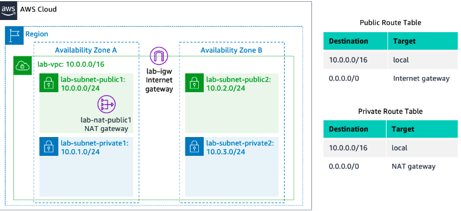
*Image Source:* AWS Training and Certification lab documentation

## 5. Implementation Procedure

The practical began by creating a custom VPC using the "VPC and more" wizard in the AWS VPC console, which provisioned the VPC, a public and private subnet in a single Availability Zone, associated route tables, an Internet Gateway, and a NAT Gateway. Two additional subnets; a second public and a second private subnet; were then manually created in a second Availability Zone to support high availability. The private route table was updated to associate the new private subnet, and the public route table was updated to associate the new public subnet, ensuring correct traffic routing across both zones.

Next, a security group named `Web Security Group` was created within the VPC, with an inbound rule permitting HTTP (port 80) traffic from any source, in order to allow web requests to reach the web server.

Finally, an EC2 instance named `Web Server 1` was launched using the Amazon Linux 2023 AMI and a `t2.micro` instance type. The instance was placed in the second public subnet, assigned a public IP address, and associated with the `Web Security Group`. A user data script was supplied to automatically install and start Apache, PHP, and MariaDB, and to deploy a sample PHP web application on first boot. Once the instance passed its status checks, its public DNS address was used to verify that the web application was accessible from a browser.

## 6. Results and Evidence

### 6.1 VPC Console Verification

Screenshots showing:

- VPC Dashboard (`lab-vpc` created)
- Subnets (2 public, 2 private, across two AZs)
- Route Tables (public and private, with correct routes to IGW / NAT Gateway)
- Internet Gateway and NAT Gateway

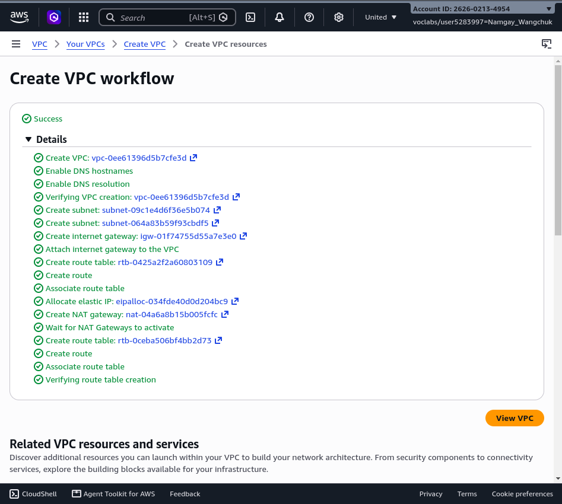

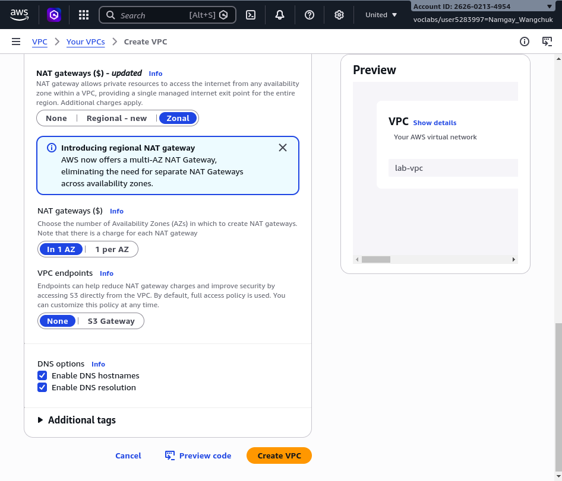

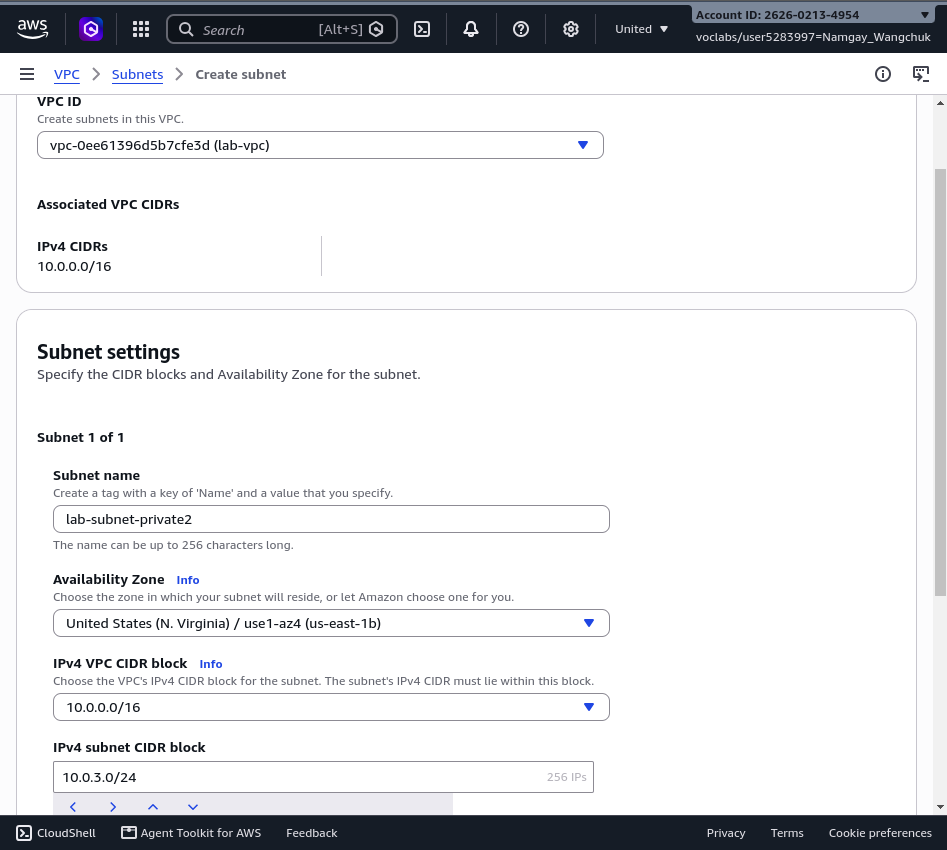

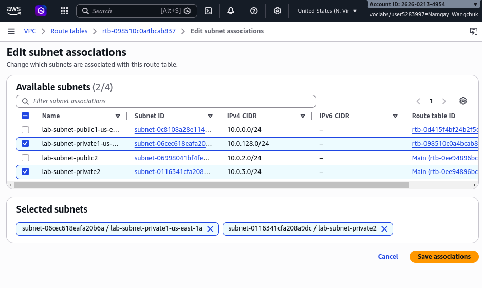

### 6.2 Security Group Configuration

Screenshot showing:

- `Web Security Group` with inbound HTTP rule (port 80, source 0.0.0.0/0)

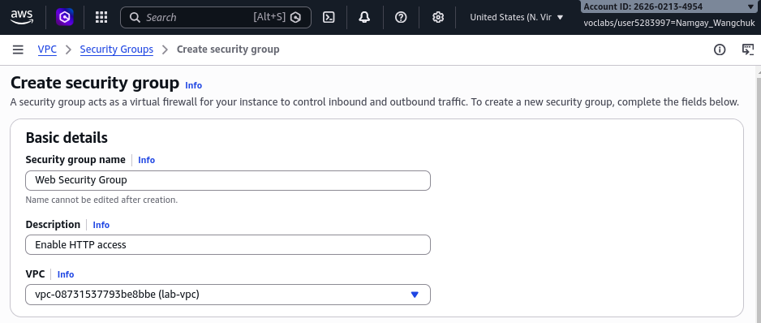

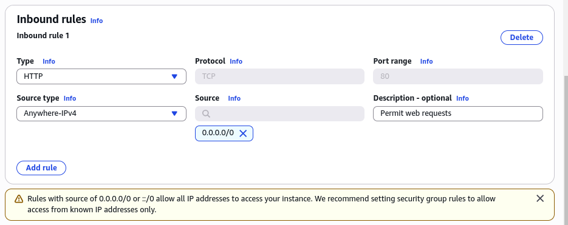

### 6.3 EC2 Instance Launch

Screenshot showing:

- `Web Server 1` instance details (AMI, instance type, subnet, security group)
- Status checks: 2/2 passed

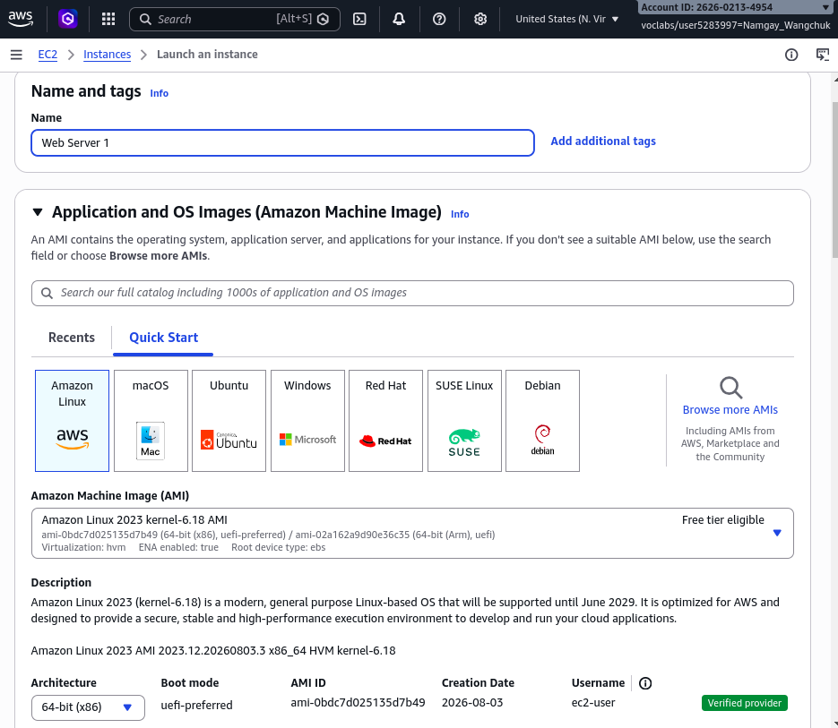

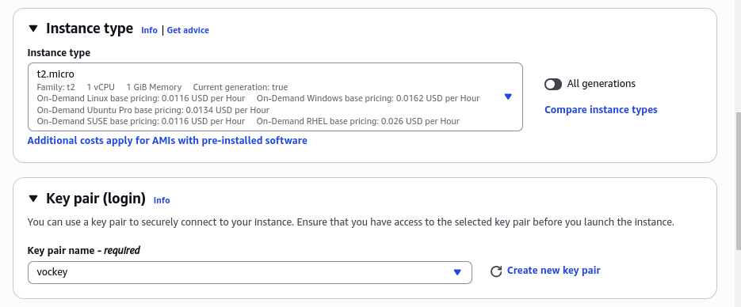

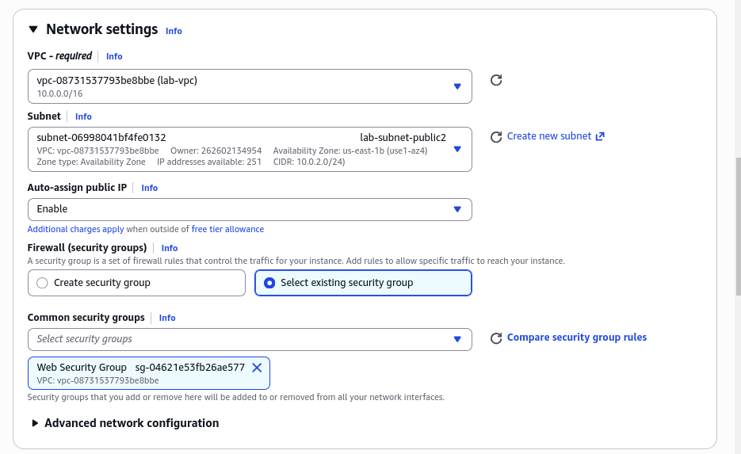

### 6.4 Web Server Verification

Screenshot showing:

- Web page displaying the AWS logo and instance metadata, accessed via the instance's Public IPv4 DNS

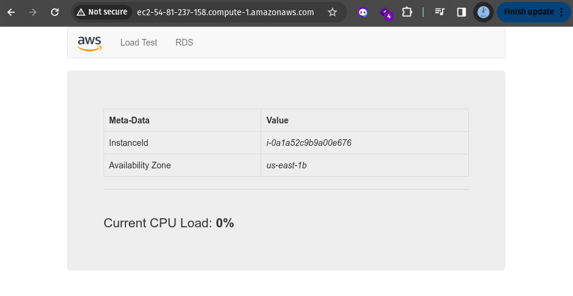

## 7. Analysis and Discussion

The practical demonstrated how Amazon VPC is used to design a segmented, multi-AZ network architecture. Public subnets route internet-bound traffic (`0.0.0.0/0`) to the Internet Gateway, while private subnets route the same traffic to the NAT Gateway, allowing outbound-only internet access without exposing private resources directly.

The security group acted as an instance-level firewall, permitting only the required HTTP traffic to reach the web server while implicitly denying all other unsolicited inbound traffic. Placing the EC2 instance in a public subnet with an auto-assigned public IP address, combined with the security group rule, allowed the web application to be reached over the internet.

All configuration steps completed successfully, and the deployed web application was verified by browsing to the instance's public DNS address. No significant errors were encountered during the setup of subnets, route tables, or the security group.

## 8. Reflection

This practical provided hands-on experience with one of the most fundamental building blocks of AWS networking. I learned how a VPC, subnets, route tables, an Internet Gateway, and a NAT Gateway work together to create a secure, segmented network, and how a security group controls access to resources at the instance level.

A key observation was the difference in routing between public and private subnets: the destination for internet-bound traffic (`0.0.0.0/0`) is the same in both route tables, but the target differs  : the Internet Gateway for public subnets, and the NAT Gateway for private subnets  : and this single difference is what defines a subnet as public or private.

In real-world cloud environments, this kind of VPC design would be used to host multi-tier applications, keeping web-facing components in public subnets and databases or application servers in private subnets, reducing the attack surface while maintaining internet connectivity where needed.

In future practical sessions, I would like to learn about:

- VPC Peering and Transit Gateway
- Network Access Control Lists (NACLs)
- Application Load Balancers within a VPC
- Auto Scaling groups across multiple AZs
- VPC Flow Logs for network monitoring

## 9. Conclusion

The objectives of this practical were successfully achieved. I gained practical experience in creating a custom VPC with public and private subnets across multiple Availability Zones, configuring route tables, creating a security group, and launching an EC2 instance to run a web server within the VPC.

This laboratory reinforced the importance of network segmentation and least-privilege access control in cloud computing, and demonstrated how Amazon VPC forms the networking foundation for secure AWS deployments.

## 10. Appendix

### Additional Files

- VPC architecture diagram

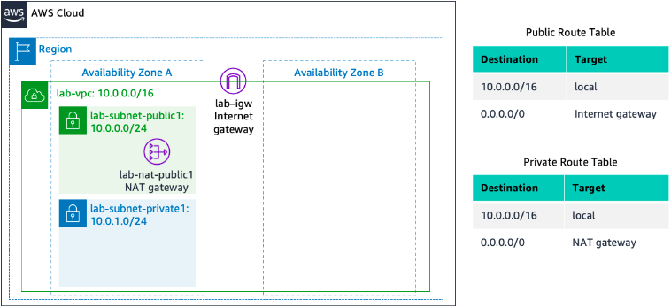

