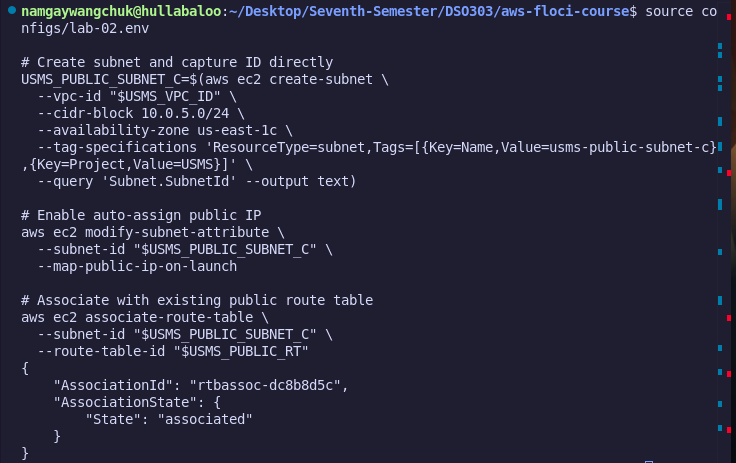
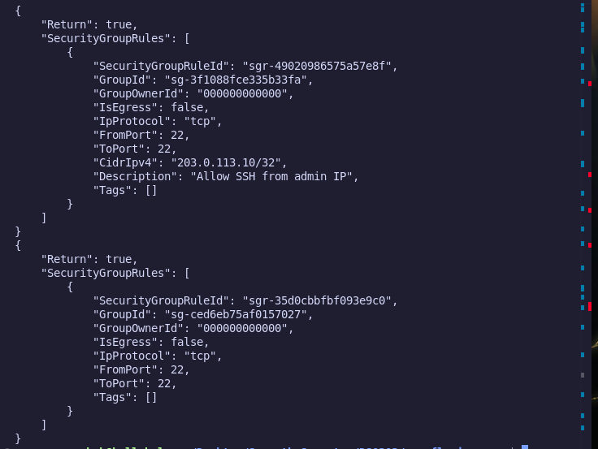
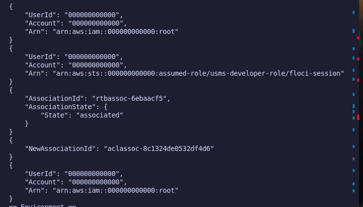
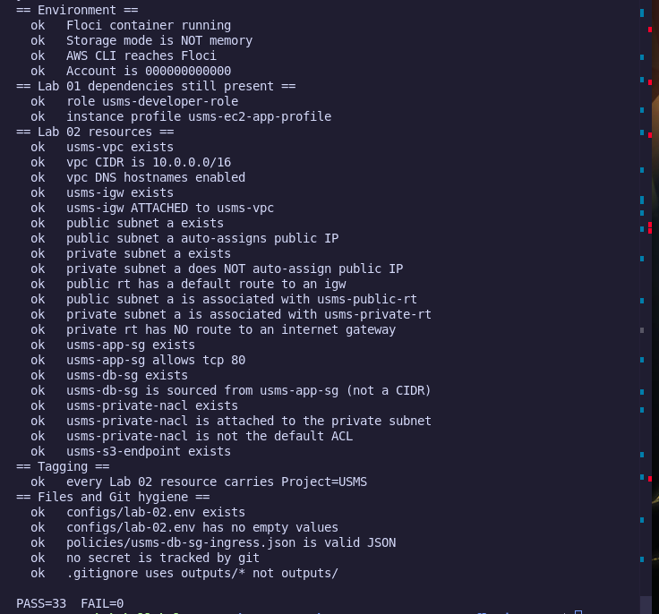

## Exercise 4: Exam-Results Service Design

### 1. Subnet Placement
The exam-results service will be deployed into `usms-private-subnet-a` (or `b`). 

*Reasoning:* It processes sensitive transcript data and must be isolated from direct internet entry while maintaining outbound internet capability via the NAT Gateway for security patches.

### 2. Security Groups
Create `usms-exam-sg`:

* **Inbound:** Allow TCP 8080/443 from `10.10.0.0/16` (Campus VPN). *Reasoning:* Restricts service entry strictly to campus networks via VPN.
* **Outbound:** Allow TCP 5432 to `usms-db-sg`. *Reasoning:* Grants necessary connectivity to query the database tier.

Modify `usms-db-sg`:
* **Inbound:** Allow TCP 5432 from `usms-exam-sg`. *Reasoning:* Authorizes the exam service to access the Postgres database tier.

### 3. NACL Justification
No NACL changes are warranted. Existing NACLs allow subnet-level transport while stateful Security Groups enforce exact instance isolation.

### 4. NAT Gateway Architecture & Cost Trade-off
We recommend running a single NAT Gateway in `us-east-1a`. 

* **Cost calculation:** AWS charges ~$0.045/hour (~$32.40/month) per NAT Gateway plus $0.045/GB data processing. Adding a second NAT Gateway in AZ `b` doubles fixed baseline costs by $32.40/month ($64.80/month total).
* **Trade-off:** Multi-AZ fault tolerance for outbound patching does not justify doubling the monthly gateway baseline cost for an internal application.

### 5. Deletion Order & Danger Note
To delete `usms-public-subnet-c`:
1. Disassociate route table: `aws ec2 disassociate-route-table --association-id <assoc-id>`
2. Delete subnet: `aws ec2 delete-subnet --subnet-id <usms-public-subnet-c-id>`

> **DANGER: PERMANENT DATA LOSS AND SERVICE DISRUPTION**
> Deleting network subnets immediately terminates all attached resources and network interfaces. Ensure no ENIs or EC2 instances are active in `usms-public-subnet-c` prior to deletion.