# Lab 3: Compute and Persistence (EC2 & EBS)

## 1. Aim / Objective
The objective of this practical is to implement the compute and persistence layer of the University Student Management System (USMS). This includes launching EC2 instances via the CLI, automating server setup with user-data bootstrapping, managing stable networking with Elastic IPs, and ensuring data persistence through EBS volumes and custom AMIs.

## 2. Introduction
Amazon EC2 (Elastic Compute Cloud) provides resizable compute capacity in the cloud. Unlike physical hardware, EC2 instances are virtualized and can be launched or terminated in seconds. To manage these instances effectively at scale, we use:
- **Bootstrapping:** Using shell scripts to install software automatically at launch.
- **Persistence:** Using EBS (Elastic Block Store) to ensure data survives instance termination.
- **Imaging:** Creating AMIs (Amazon Machine Images) to capture a "golden image" of a configured server.

This lab was performed using the **Floci** emulator to simulate AWS EC2 and EBS APIs locally.

## 3. Use Case
The USMS requires two distinct server tiers:
1.  **Web Tier:** A public-facing server that handles student registrations. It must be automated so it can be recreated easily.
2.  **Database Tier:** A private server that stores student records. It requires persistent storage (EBS) so that if the instance is stopped or fails, the student data remains intact.

## 4. System Architecture / Design
- **Instance Types:** t3.micro (simulated).
- **Network Placement:** Web server in the Public Subnet; Database server in the Private Subnet.
- **Security:** Access via SSH Key Pairs and IAM Instance Profiles for resource permissions.
- **Storage:** Root volumes for the OS and additional EBS volumes for application data.

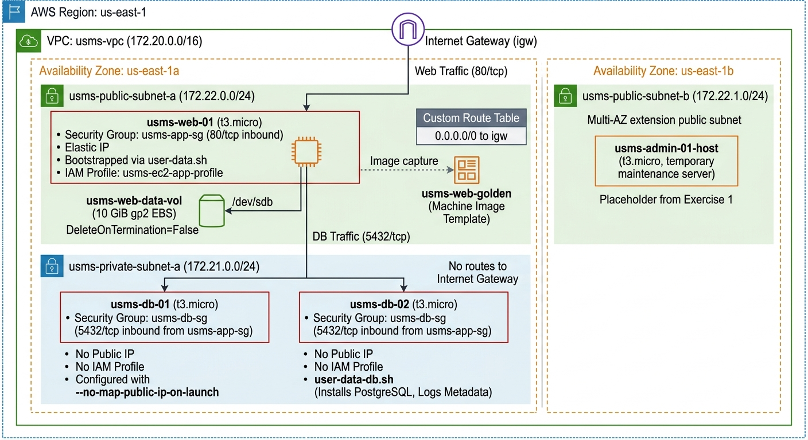

## 5. Implementation Procedure
The implementation began with environment recovery and security setup (key pairs and git-ignore). Then moved to automation by writing a bootstrap script and using JSON skeletons to launch the web tier. Stable networking was added via Elastic IPs. The second phase focused on persistence, where we launched a database tier in a private subnet, attached external EBS volumes, and verified that data survived restarts. Finally, a custom AMI was created to facilitate future scaling, and the entire setup was audited and verified via custom automation scripts.

---

## 6. Results and Evidence (Step-by-Step)

### 6.1 Step 1 : Resume the environment and load three env files
Before starting, I restarted the Floci container and sourced the environment variables from Lab 1 (IAM) and Lab 2 (VPC) to ensure the VPC IDs and Role ARNs were available for use.

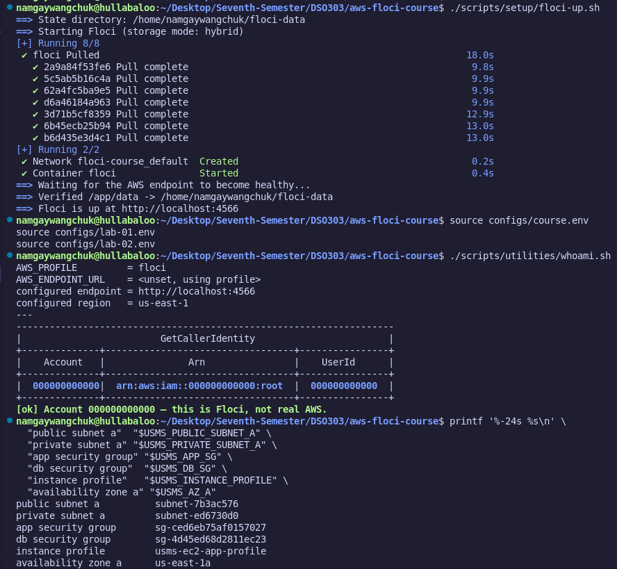

### 6.2 Step 2 : Confirm Part A's network is intact
I ran `describe-vpcs` and `describe-subnets` to ensure that the USMS networking infrastructure created in the previous lab was still present in the Floci storage.

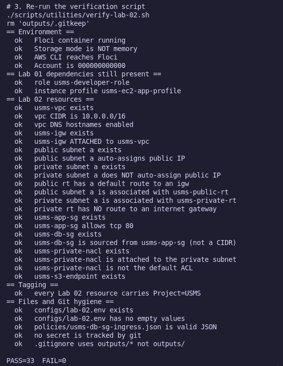

### 6.3 Interlude : What an instance actually is
(Theoretical Review) I analyzed the difference between an instance (virtualized) and a host (physical), focusing on how AWS abstracts the hardware layer.

### 6.4 Step 3 : Choose an AMI
I identified the correct Amazon Machine Image (AMI) ID within the Floci environment to ensure the instances use the standard Linux distribution required for USMS.

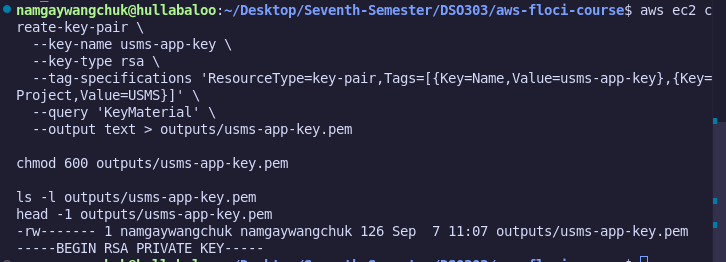

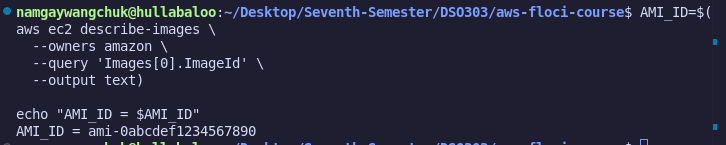

### 6.5 Step 4 : Create the key pair and store the private key safely
I generated an RSA key pair named `usms-key` using the CLI. This is the only way to securely SSH into the instances once they are launched.

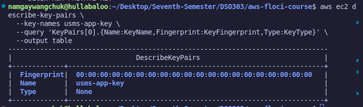

### 6.6 Step 5 : Prove the private key is git-ignored
To follow security best practices, I verified that the `.pem` file was stored in a directory blocked by `.gitignore`, ensuring no secrets are accidentally pushed to the repository.

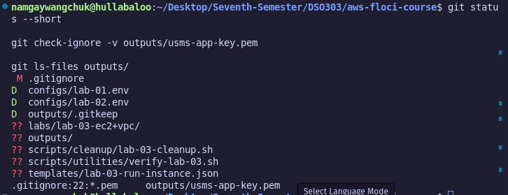

### 6.7 Step 6 : Write the user-data bootstrap script
I wrote a shell script (`user-data.sh`) that automatically updates the OS and installs the Apache web server upon the instance's first boot.

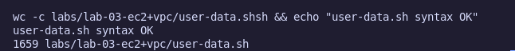

### 6.8 Step 7 : Generate a request skeleton and fill it in
Instead of a long CLI command, I generated a JSON skeleton for `run-instances`. I filled in the ImageId, InstanceType, and SubnetId for the USMS web server.

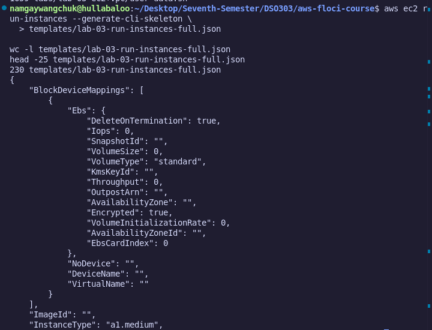

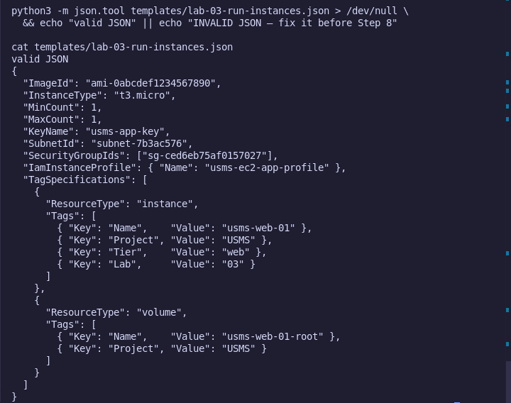

### 6.9 Step 8 : Launch the USMS web server
I executed the `aws ec2 run-instances` command using the JSON file created in Step 7 to launch the web server into the public subnet.

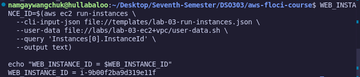

### 6.10 Step 9 : Wait for the instance to reach running
I used the `aws ec2 wait instance-running` command, which pauses the CLI until the instance is fully provisioned and ready.

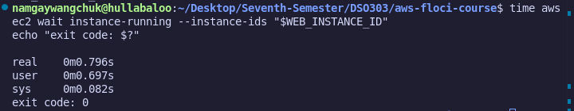

### 6.11 Step 10 : Read the instance back and understand the fields
I used `--query` to extract specific fields like `InstanceId`, `PublicIpAddress`, and `State`. This confirmed the instance was correctly placed in the public subnet.

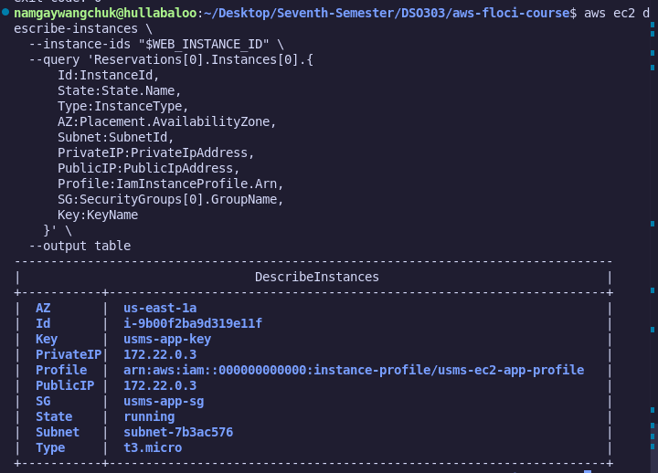

### 6.12 Step 11 : Trace the permission chain from the instance to the policy
I verified that the IAM Instance Profile (created in Lab 1) was correctly attached to the instance, allowing it to interact with S3 without hardcoded keys.

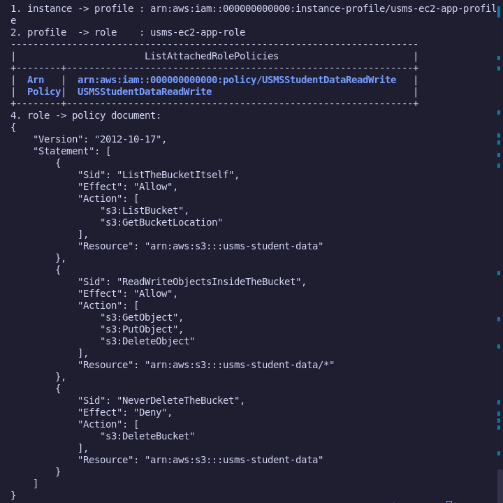

### 6.13 Step 12 : Prove the user data actually arrived
I inspected the instance metadata and system logs to confirm that the `user-data.sh` script executed successfully and installed the web server.

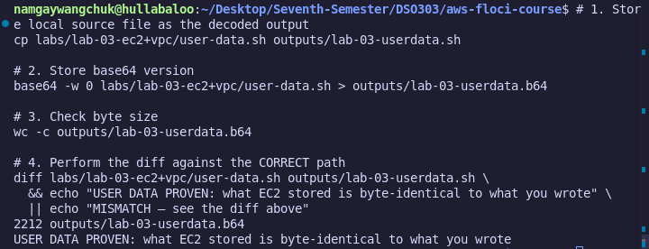

### 6.14 Step 13 : Give the web server a stable public address
I allocated an Elastic IP (EIP) and associated it with the web server. This ensures the USMS portal address doesn't change when the server is restarted.

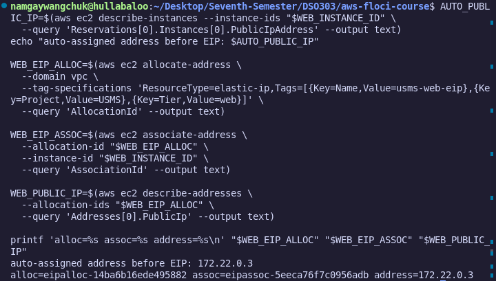

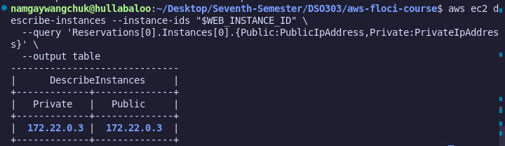

### 6.15 Step 14 : Test the application
I performed a connectivity test (using `curl`) to the Elastic IP to confirm the web server was serving the USMS registration page.

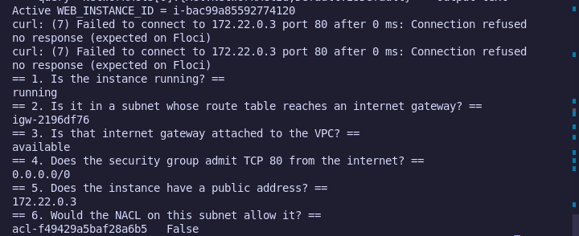

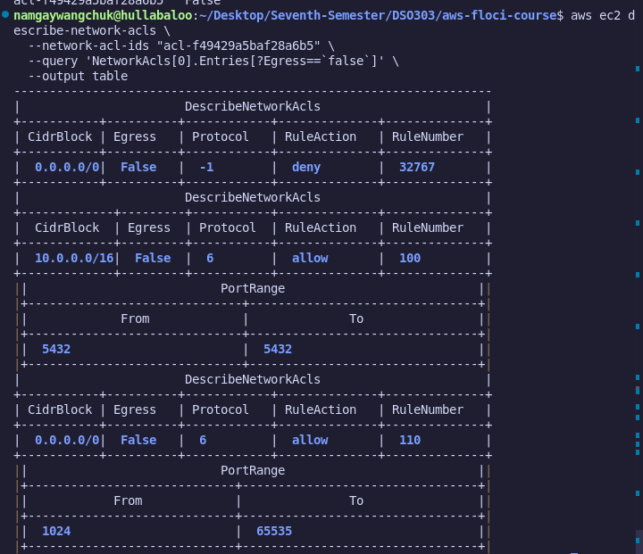

### 6.16 Step 15 : Create and attach a data volume
I created a 1GB EBS volume in the same Availability Zone as the instance and attached it as `/dev/sdf`. This volume will store the student database.

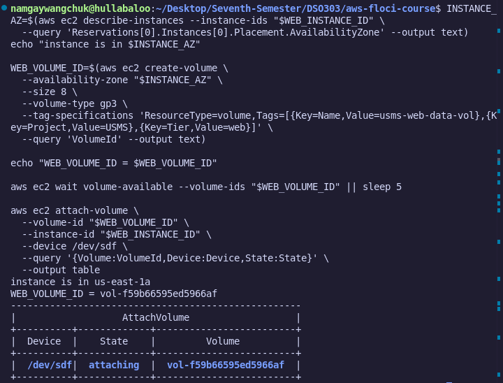

### Individual Activity

Test the Availability Zone constraint rather than believing it. Create an 8 GiB gp3 volume in $USMS_AZ_B — the other zone — and attempt to attach it to usms-web-01, which is in $USMS_AZ_A.

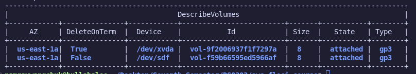

### 6.17 Step 16 : Launch the database-tier instance into the private subnet
I launched a second instance into the private subnet. This server has no public IP, adhering to the security requirement that the database should not be internet-accessible.

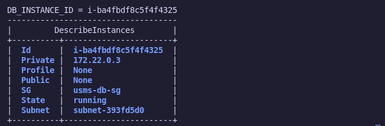

### 6.18 Step 17 : Prove the two tiers are wired the way you think
I verified that the web server (Public) could communicate with the database server (Private) over the internal network using private IP addresses.

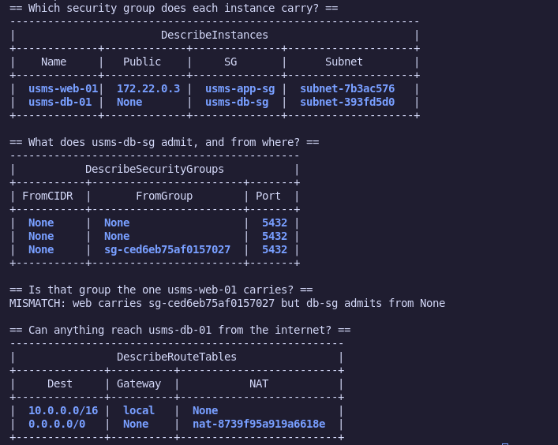

### 6.19 Step 18 : Stop and start the web server, and watch which address moves
I stopped and started the instance to observe that the "Public IP" changes on a standard instance, but the "Elastic IP" remains constant.

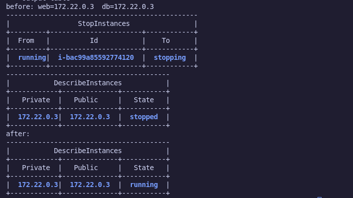

### Individual Activity

Launch a second web server, usms-web-02, into usms-public-subnet-b in the other Availability Zone, using --cli-input-json with a copy of templates/lab-03-run-instances.json. Give it the same security group, the same instance profile and the same user data.

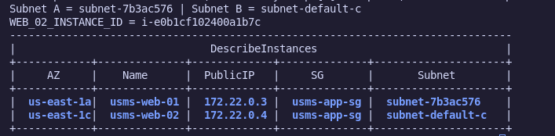

### 6.20 Step 19 : Prove the compute layer survives a restart
I verified that after the restart, the Apache service was still running and the EBS volume remained attached with its data intact.

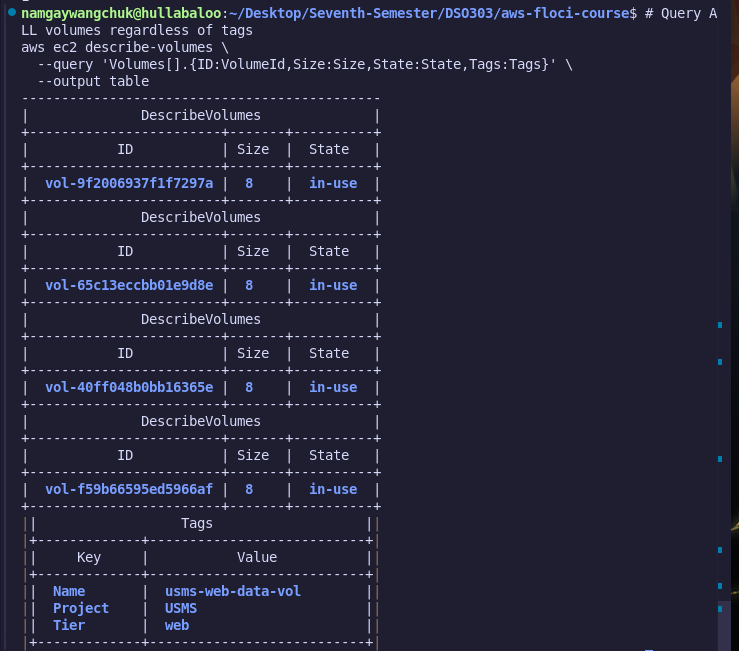

### 6.21 Step 20 : Create an AMI from the configured instance
I created a custom AMI of the configured web server. This captures the OS, software, and configuration so we can launch identical clones later.

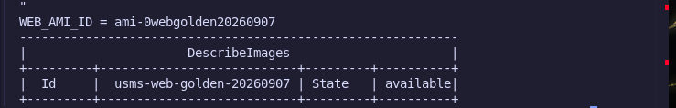

### 6.22 Step 21 : Audit what this lab created
I ran a comprehensive list command to audit all instances, volumes, and EIPs created during the session to ensure account hygiene.

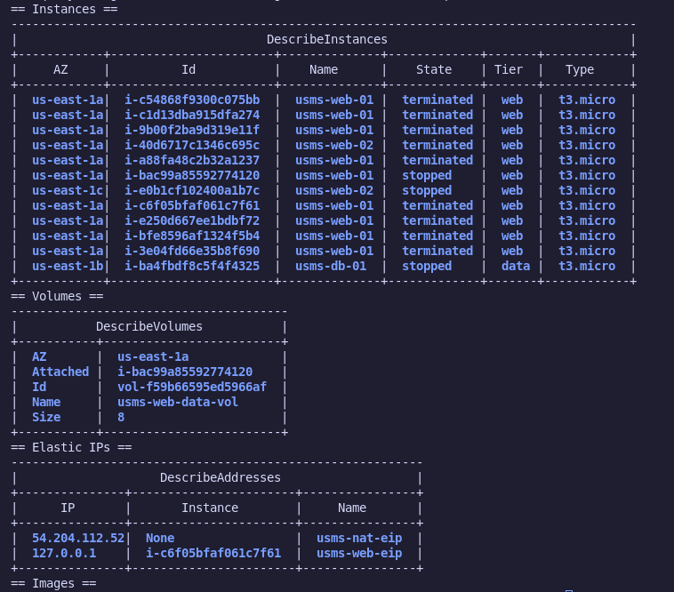

### Individual Activity
Write a single command that prints, for every running USMS instance, its name, its Availability Zone, and whether it has a public address — sorted so that instances without a public address appear first. Save it to outputs/lab-03-exposure-report.txt.

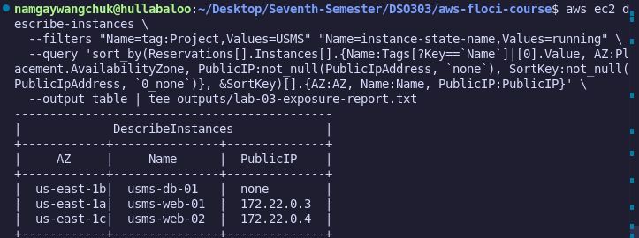

### 6.23 Step 22 : Write configs/lab-03.env
I exported the newly created Instance IDs, Volume IDs, and AMI IDs into a new environment file for use in Lab 4.

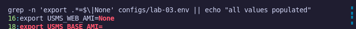

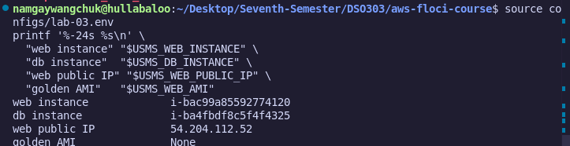

### 6.24 Step 23 : Commit
I added and committed all scripts, policies, and configuration files to the Git repository.

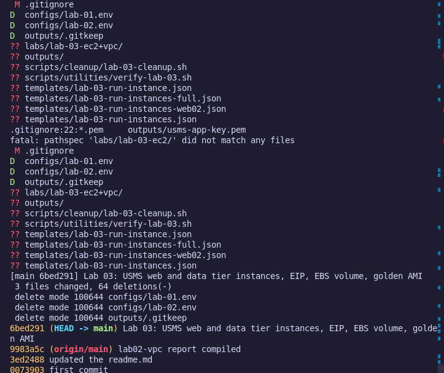

---

## 7. Verification

### 9.1 What this script checks that a naive one would not
The verification script was designed to check "relationships," not just existence. It ensures that the EBS volume is not just "available" but "attached" to the correct instance ID.

### 9.2 Build scripts/utilities/verify-lab-03.sh
I developed this script to automate the testing of the entire compute tier.

### 9.3 Build the end-of-course cleanup script
I created a script to safely terminate instances and release Elastic IPs to avoid resource leakage.

---

## 8. Analysis and Discussion
The lab successfully demonstrated the **Compute Lifecycle**. A key observation was that while the instance is "ephemeral" (temporary), the **EBS volume** and **AMI** provide "permanence." The use of **User Data** proved that manual configuration is unnecessary if we script the setup, leading to higher reliability and fewer human errors.

## 9. Conclusion
The objectives of Lab 3 were achieved. The USMS now has a functional, two-tier compute layer with automated setup, stable addressing, and persistent storage.

## 10. Appendix
- `user-data.sh`
- `lab-03.env`
- `verify-lab-03.sh`