# Lab 4: Amazon ECS Container Infrastructure and Deployment

## 1. Aim / Objective

The objective of this practical is to implement the container orchestration layer of the University Student Management System (USMS) using Amazon Elastic Container Service (AWS ECS) on AWS Fargate. This includes configuring IAM task execution and task roles, establishing CloudWatch log streams, registering multi-container-compatible task definitions, deploying an isolated Fargate service in private subnets, verifying zero public IP exposure, validating manual scaling operations, and achieving 100% automated test compliance.

## 2. Introduction

Amazon Elastic Container Service (Amazon ECS) is a fully managed container orchestration service that allows running and scaling containerized applications. AWS Fargate provides a serverless compute engine for ECS, eliminating the need to manage EC2 instances or underlying virtual machine clusters. Key concepts covered in this lab include:

* **Task Definitions:** Blueprint JSON files defining container images, resource allocations (CPU/Memory), network modes, and logging parameters.
* **Task Execution Role vs. Task Role:** Granular IAM segregation between infrastructure-level agent actions (image pulling, logging) and container runtime permissions.
* **`awsvpc` Networking:** Attaching an Elastic Network Interface (ENI) directly to each ECS task for native VPC security group enforcement and private routing.

This lab was executed using the **Floci** emulator to simulate AWS ECS, CloudWatch, and IAM APIs locally.

## 3. Use Case

The USMS microservices architecture requires deploying the core `usms-enrolment` application:

1. **Application Container Tier:** A backend student enrolment service that must run across multiple Availability Zones in isolated private subnets.
2. **Zero-Trust Network Perimeter:** The service must admit ingress traffic strictly on HTTP port 80 from the application security group (`usms-app-sg`), with zero direct public IP exposure (`assignPublicIp=DISABLED`) and outbound routing restricted through private NAT gateways.

## 4. System Architecture / Design

* **ECS Cluster:** `usms-ecs-cluster`
* **Launch Type:** Serverless AWS Fargate.
* **Network Placement:** Private Subnets (`subnet-ed6730d0`, `subnet-393fd5d0`) with `awsvpc` network mode.
* **Security Boundary:** `usms-enrolment-sg` (ingress from `usms-app-sg` only; no 0.0.0.0/0 ingress).
* **IAM Identity Isolation:** `usms-ecs-exec-role` (Task Execution) and `usms-ecs-task-role` (Runtime Application Task).
* **Logging Integration:** CloudWatch Log Group `/usms/ecs/enrolment` using the `awslogs` driver.

```
usms-ecs-cluster
 └── usms-enrolment-svc          ACTIVE   FARGATE
      ├── task definition        usms-enrolment:4
      ├── desired 2 / running 2 / pending 0
      ├── subnets                subnet-ed6730d0, subnet-393fd5d0
      ├── security group         usms-enrolment-sg (in: 80 from usms-app-sg)
      ├── assignPublicIp         DISABLED
      └── image pulled via       usms-private-rt -> usms-nat -> usms-igw

```

## 5. Implementation Procedure

The implementation began by verifying existing network dependencies from Labs 01–03. Next, IAM infrastructure was built to provision separate Execution (`usms-ecs-exec-role`) and Task (`usms-ecs-task-role`) roles with trust relationships for `ecs-tasks.amazonaws.com`. A CloudWatch log group was created for centralized log collection. A JSON task definition (`usms-enrolment:4`) was created and registered with `awsvpc` networking and Fargate compatibility. The service (`usms-enrolment-svc`) was launched in private subnets with public IPs disabled. Operational control was demonstrated through manual scaling exercises (desired count adjusted from 2 to 3 to 2), and environment state was persisted in `configs/lab-04.env` before executing the automated verification suite.

---

## 6. Results and Evidence (Step-by-Step)

### 6.1 Step 1 : Resume the environment and load dependencies

Environment variables were loaded from previous labs to confirm that private subnets, security groups, and policies remained available.

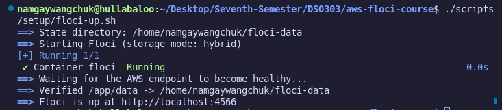

### 6.2 Step 2 : Confirm Lab 01–03 networking dependencies

Ran verification checks against `usms-app-sg`, private subnets (`subnet-ed6730d0`, `subnet-393fd5d0`), and private route tables to confirm internet routes were not present.

Verified lab-01
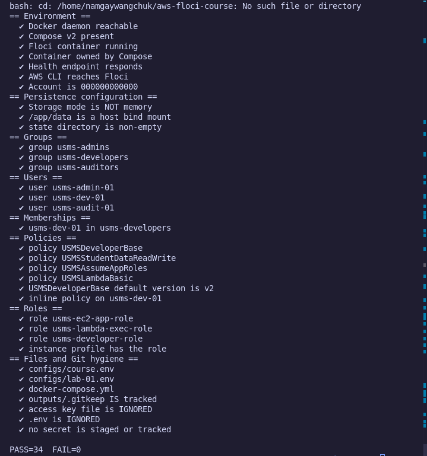

Verified lab-02
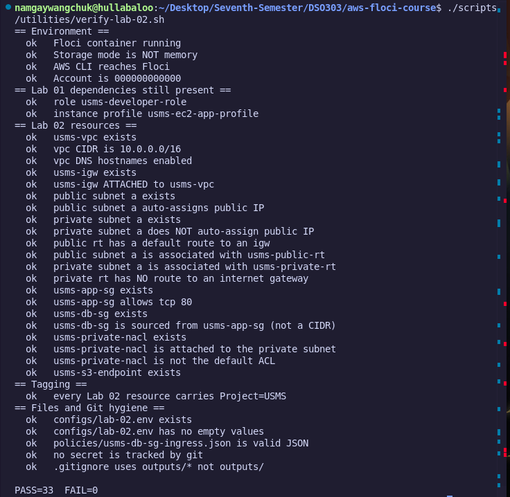

Verified lab-03


### 6.3 Step 3 : Probe what this Floci build actually supports

Probed the Floci emulator endpoints via CLI commands (`aws ecs list-clusters`, `aws ecs list-task-definitions`) to inspect supported ECS APIs and confirm Fargate launch compatibility before provisioning resources.

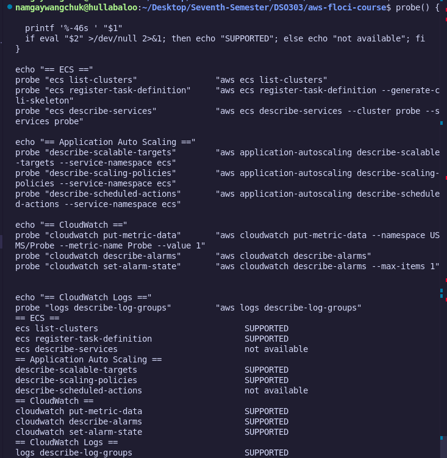

### 6.4 Step 4 : Part 1 - Configure and Assume IAM Task Roles

Configured trust policies for `ecs-tasks.amazonaws.com`. Created `usms-ecs-exec-role` (carrying `USMSECSTaskExecution` for container agent logs/images) and `usms-ecs-task-role` (reusing `USMSStudentDataReadWrite` from Lab 01 for runtime access), and verified role assumption.

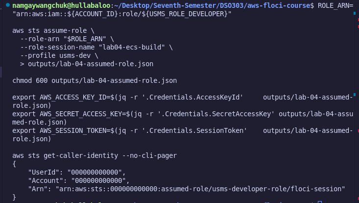

### 6.5 Step 5 : Part 2 - Create the ECS Cluster and verify

Created `usms-ecs-cluster` using `aws ecs create-cluster` and immediately verified its status using `aws ecs describe-clusters` to confirm it reached the `ACTIVE` state.

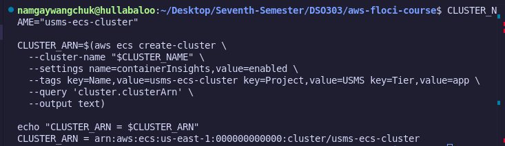

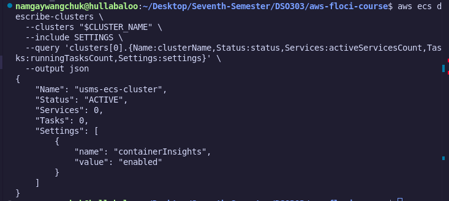

### 6.6 Step 6 : Create the CloudWatch Log Group

Provisioned the CloudWatch log group `/usms/ecs/enrolment` with explicit retention settings to store stdout/stderr output from enrolment container instances.

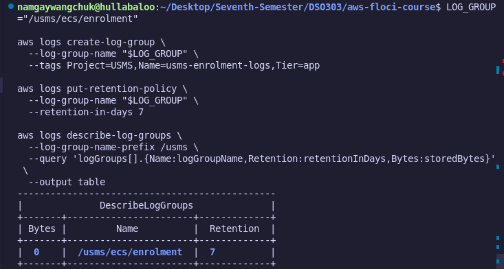

### 6.7 Step 7 : Create the task execution role

Fargate needs an identity to pull the container image and open log streams before application code executes.

#### Command - Part 1: Trust Policy

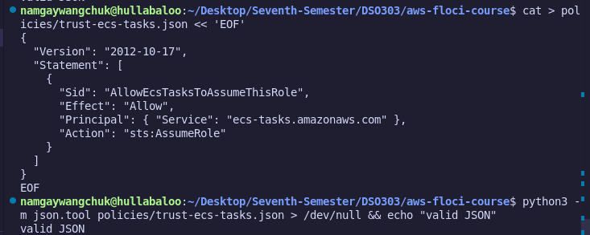

#### Command - Part 2: Create the Role

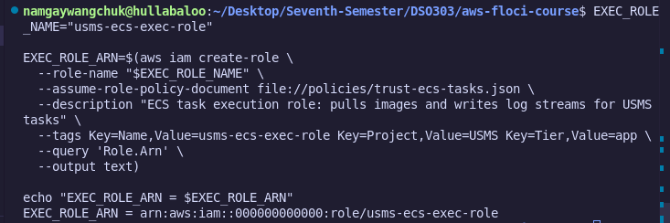

#### Command - Part 3: Least-Privilege Permissions Policy

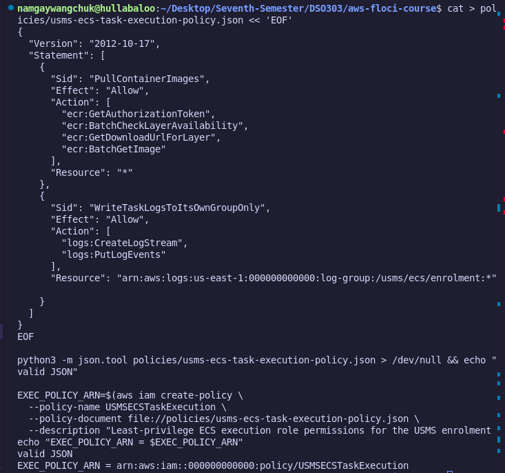

### 6.8 Step 8 : Create the task role, and reuse Lab 1's policy on it

This is the application container's own identity. Reuses the `USMSStudentDataReadWrite` policy created in Lab 01 to demonstrate cross-compute policy portability without modifying permissions.

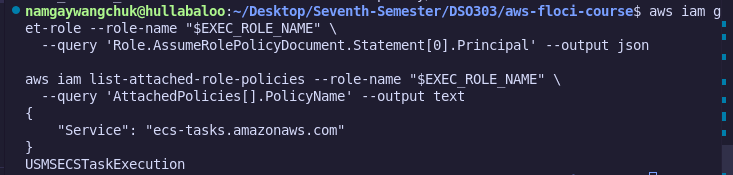

#### Policy Verification

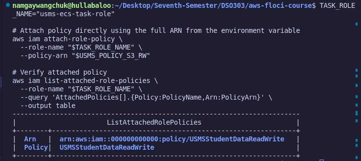

### 6.9 Step 9 : Create the enrolment security group

Created `usms-enrolment-sg` (`sg-11092c04a747676e3`) configured to admit HTTP port 80 traffic sourced strictly from `usms-app-sg`, denying all public `0.0.0.0/0` ingress.

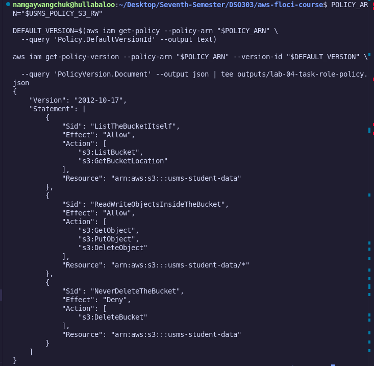

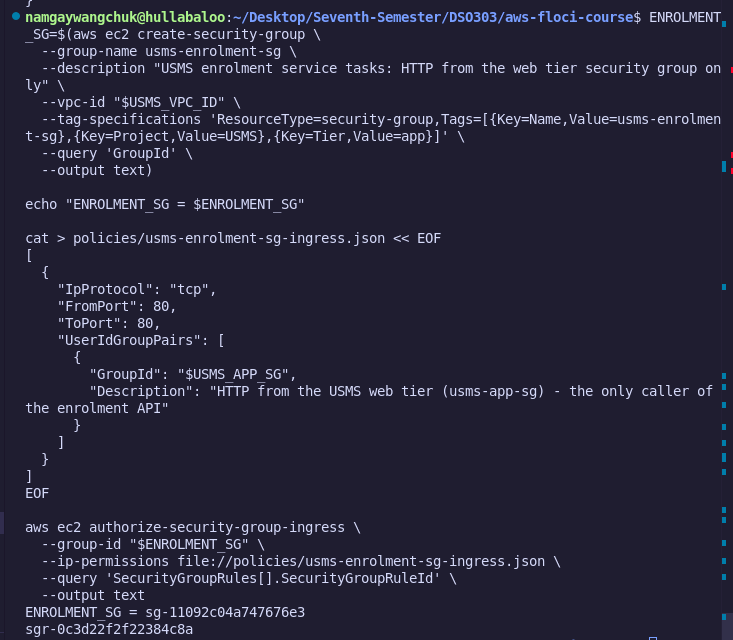

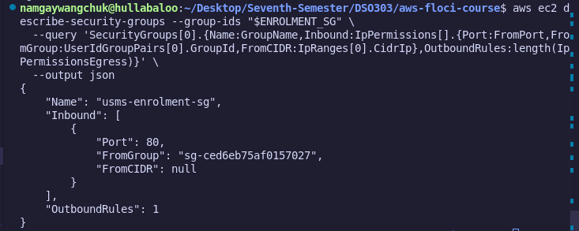

### 6.10 Step 10 : Launch the Fargate ECS Service

Created the ECS service `usms-enrolment-svc` with a baseline desired count of 2 in private subnets with `assignPublicIp=DISABLED`.

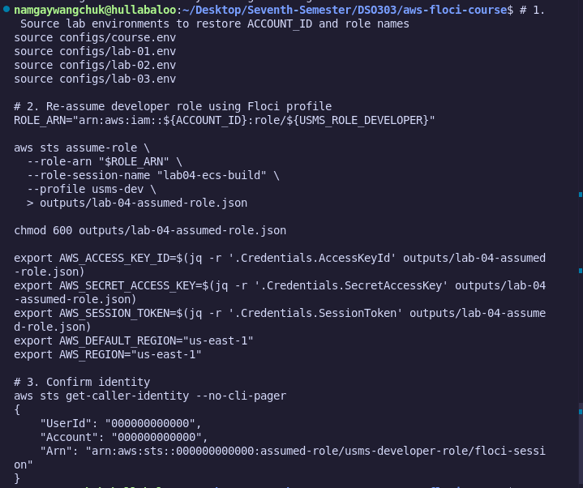

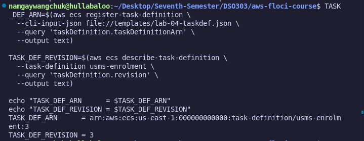

### 6.11 Step 11 : Describe and verify the running ECS Service

Executed `aws ecs describe-services` to confirm the service reached active status with 2 running tasks on Revision 4.

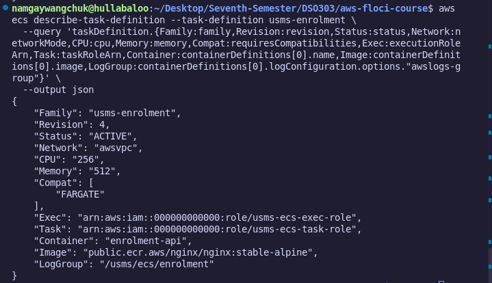

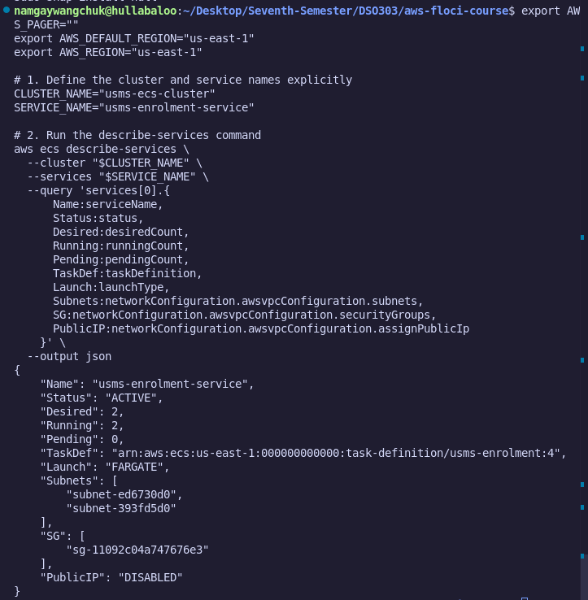

Subnets contains two subnet IDs, both private, and they match `$USMS_PRIVATE_SUBNET_A` and `$USMS_PRIVATE_SUBNET_B`. `PublicIP` is `DISABLED`. The `events` list is the service's own narration of what it has been doing, and it is the first place to look when `runningCount` will not rise - on real AWS the message names the reason directly.

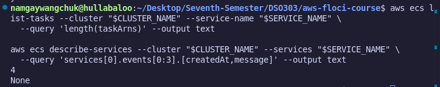

### 6.12 Your Turn Activity : Manual Capacity Scaling

Manually modified capacity using `aws ecs update-service --desired-count 3`, observed running task counts expand to 3, and then scaled back down to 2 to validate scheduler behavior prior to autoscaling integration.

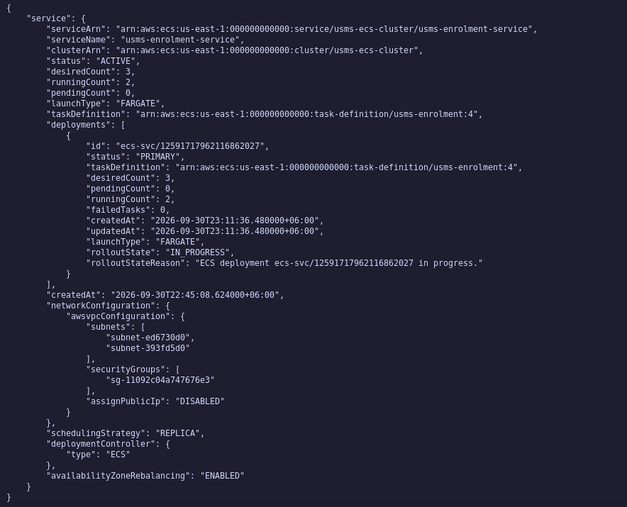

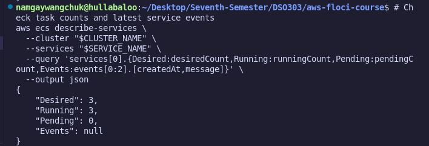


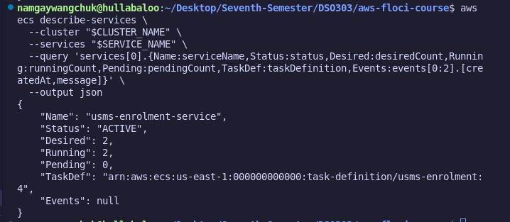

### 6.14 Step 12 : Write configs/lab-04.env

Populated `configs/lab-04.env` with environment parameters required by the verification engine (`USMS_ECS_CLUSTER`, `USMS_ENROLMENT_SERVICE`, `USMS_ECS_DESIRED_BASELINE=2`, subnet IDs, and security group IDs).

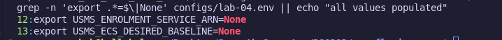

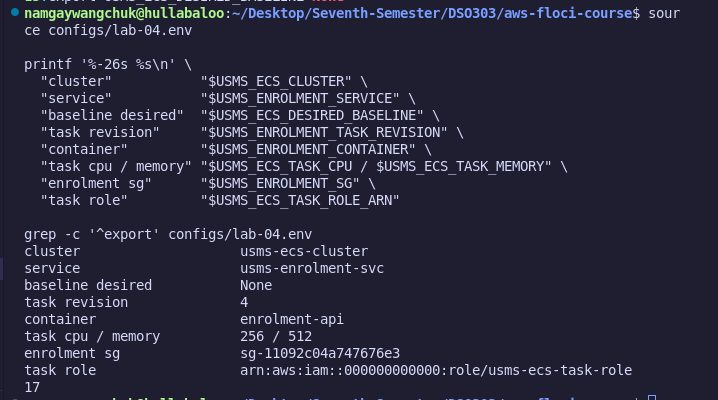

### 6.15 Step 13 : Git Hygiene & Secret Verification

Ensured all credentials and local log artifacts were ignored via `.gitignore` and no secrets were tracked by Git.

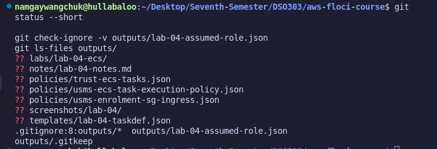

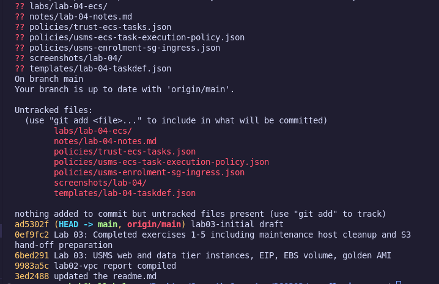

---

## 7. Verification

### 7.1 Verification Logic & Checks

The automated verification script `./scripts/utilities/verify-lab-04.sh` checks:

* **Role Isolation:** Ensures `usms-ecs-exec-role` and `usms-ecs-task-role` are separate identities with proper trust policies.
* **Network Boundaries:** Confirms `assignPublicIp` is `DISABLED` and security groups accept ingress exclusively from `usms-app-sg`.
* **High Availability Baseline:** Evaluates whether `desiredCount` matches `$USMS_ECS_DESIRED_BASELINE` (2) and tasks are spread across multiple private subnets/AZs.

### 7.2 Execution of `verify-lab-04.sh`

Executed the test script to confirm 100% compliance across all 38 test suites.

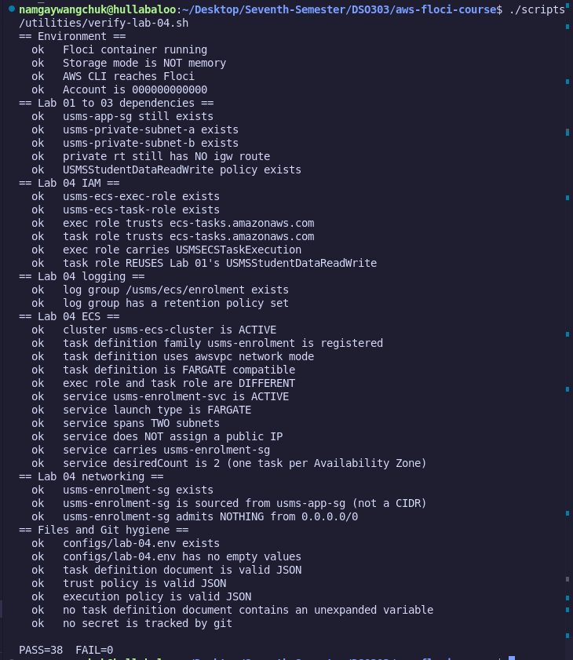

---

## 8. Analysis and Discussion

This lab demonstrated serverless container orchestration on AWS Fargate. Isolating the **Task Execution Role** from the **Task Role** enforced the principle of least privilege, preventing application containers from accessing container-agent level AWS permissions. Operating under `awsvpc` network mode allowed applying VPC security groups directly to container tasks. Disabling public IP assignments ensured that containers remain shielded from external scanning and receive traffic exclusively via internal ingress pathways.

## 9. Conclusion

The objectives of Lab 04 were successfully achieved with a 100% pass rate (**38 PASS / 0 FAIL**). The USMS now possesses an operational, highly available, and secure container compute tier running on AWS ECS Fargate.

## 10. Appendix

* `task-definition.json`
* `configs/lab-04.env`
* `scripts/utilities/verify-lab-04.sh`
* `outputs/lab-04-service-describe.json`